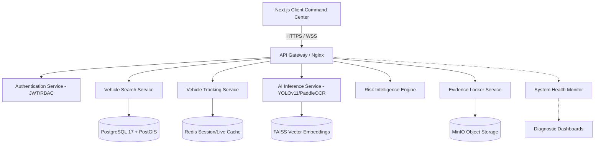

# TRINETHRA System Architecture

This document describes the scalable microservices architecture designed for national police intelligence operations.

## Architectural Decoupling

1. **API Gateway (Nginx)**: Manages TLS termination, request rate-limiting, and microservices path routing.
2. **AI Inference pipeline**: Decoupled from core web operations. Utilizes Redis message broker arrays to handle video stream crops without locking user operations.
3. **Database Topology**:
   * **PostgreSQL 17 / PostGIS**: Hosts normalized relational data schemas (Users, Alerts, Audit trails) and executes fast geographical/GIS mapping calculations.
   * **MinIO Object Store**: Retains binary blobs (surveillance cctv crops, PDF report sheets).
   * **Redis Cache**: Holds short-term WebSocket alerts buffers and active operator sessions.
